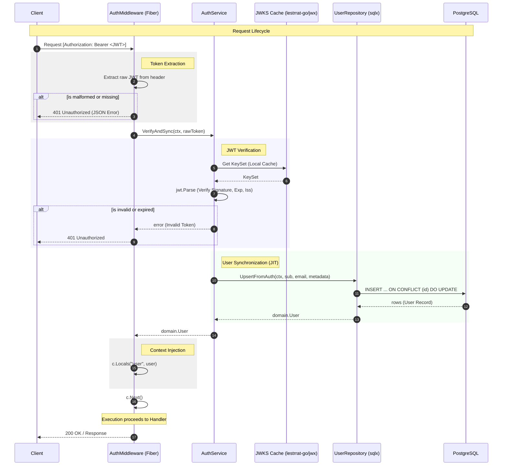

# Authentication Flow Diagram

This diagram illustrates the sequence of operations for authenticating a request and synchronizing the user profile with the local database.

## Flow Description

1.  **Request Initiation**: The client sends an HTTP request with the `Authorization: Bearer <JWT>` header.
2.  **Middleware Extraction**: The Fiber middleware extracts the token. If missing or the scheme is not `Bearer`, it returns an immediate `401`.
3.  **Service Delegation**: The middleware calls `AuthService.VerifyAndSync`.
4.  **Signature Verification**: The service uses cached JWKS keys (fetched from Supabase at startup/refreshed periodically) to verify the token's cryptographic signature.
5.  **Claim Validation**: The service validates standard claims (`exp`, `iss`).
6.  **Just-In-Time (JIT) Sync**: The service extracts the user identity (from the `sub` claim) and updates/creates the local user record in PostgreSQL via the `UserRepository`.
7.  **Success Path**: The local `User` object is returned to the middleware.
8.  **Context Storage**: The middleware stores the `User` object in Fiber's `c.Locals`, making it available to all subsequent handlers in the request chain.
9.  **Next**: The middleware calls `c.Next()`, passing control to the business logic handler.
