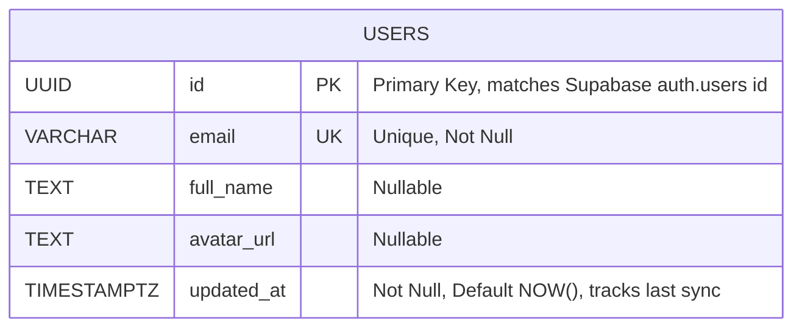

# User Database Design

This document contains the Entity-Relationship (ER) diagram for the local proxy `users` table, which serves to synchronize profile data from Supabase Auth.

### Table Details

- **`users`**: The core local representation of a user.
  - `id`: Used as the primary lookup and relational key for all local business entities. Directly mirrors the `sub` claim / `uuid` from the Supabase JWT.
  - `email`: Indexed for fast email-based lookups, guaranteed unique.
  - `full_name` & `avatar_url`: Supplementary profile information extracted from Supabase metadata during login.
  - `updated_at`: The timestamp tracking when the local database was last synchronized with Supabase's data payload.
