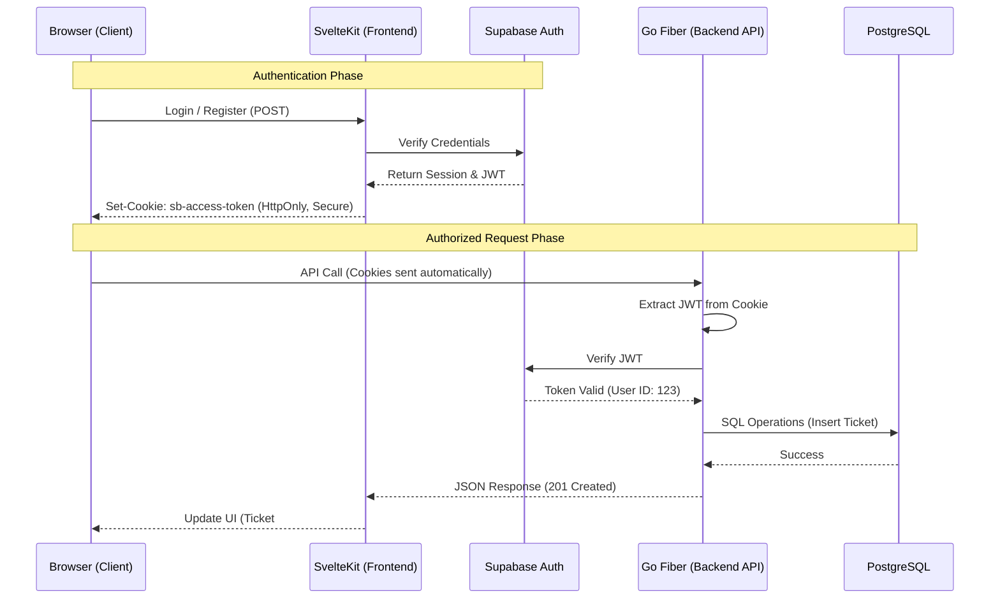
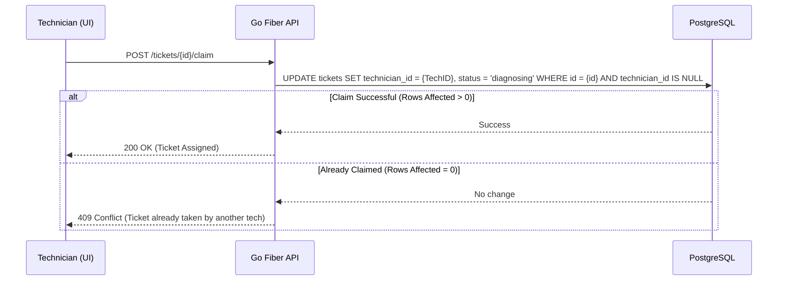
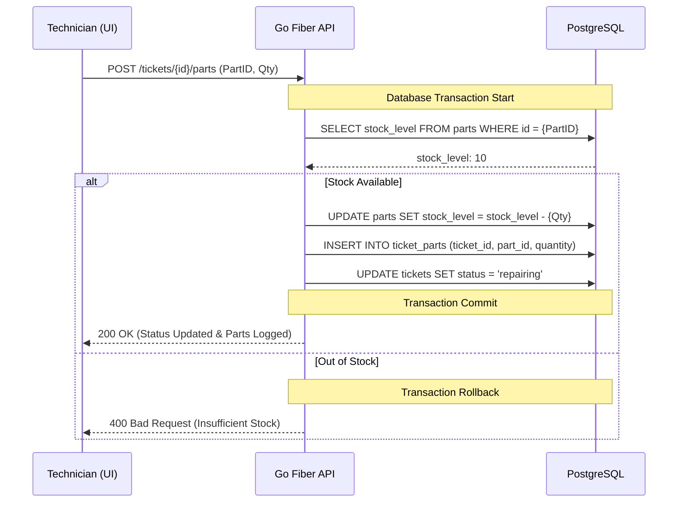
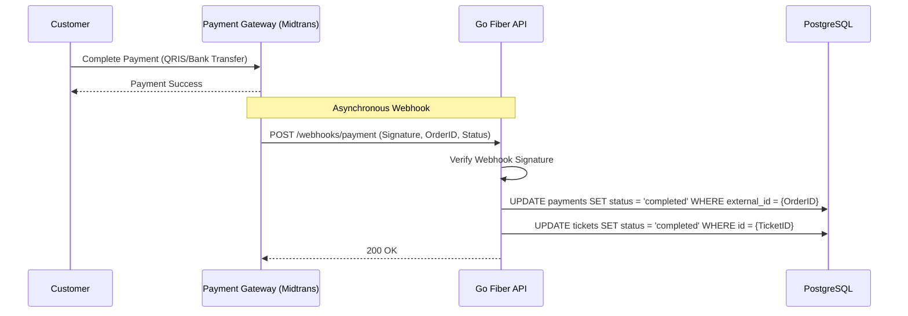

# System Architecture - PhoneFix

This document outlines the technical flow and interaction between the Client, Frontend, Backend, and Third-party services.

## 1. High-Level Flow (Authentication & Data)

The following sequence diagram illustrates how a user request is handled from the browser through to the database, using Supabase for identity management.

## 2. Specific Feature Flows

### 2.1 Ticket Claiming Flow (First-Come, First-Served)
This flow handles how a technician "Takes" a ticket from the public queue. It uses a conditional update to prevent double-claiming.

### 2.2 Repair & Inventory Workflow
This flow ensures that when a technician marks a repair as "In-Progress" or "Completed", the parts used are correctly deducted from the inventory within a database transaction.

### 2.3 Online Payment Flow (Webhooks)
This flow handles the asynchronous update of payment status when a customer pays via a gateway like Midtrans.

## 3. Component Responsibilities

### 3.1 SvelteKit (Frontend)
*   Handles routing and page rendering.
*   **Session Management**: Uses `@supabase/ssr` to manage auth sessions in `HttpOnly` cookies.
*   **Auth Proxy/Server Actions**: Handles login/logout server-side to set/clear cookies.
*   Proxies/Calls the Go Backend; browser attaches cookies automatically.
*   Provides a premium, responsive UI with vanilla CSS.

### 3.2 Go Fiber (Backend)
*   Exposes a RESTful API.
*   **Auth Middleware**: Extracts the JWT from the `Cookie` header (e.g., `sb-access-token`) and verifies it with Supabase.
*   **Business Logic**: Handles complex validations, invoicing logic, and inventory math.
*   **Database Access**: Communicates with PostgreSQL.

### 3.3 Supabase Auth
*   Identity Provider (IdP).
*   Handles email/password and social login providers.
*   Issues short-lived JWTs for secure API access.

### 3.4 PostgreSQL
*   The source of truth for business data (Tickets, Inventory, Customer details).
*   Linked to Supabase users via a `supabase_uid` mapping.

---
*Last Updated: 2026-04-30*
