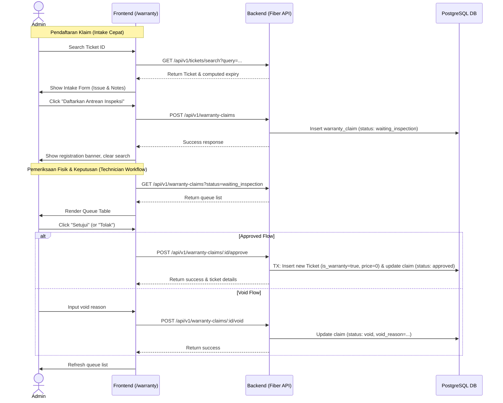

# Design Specification: Warranty Claims Queue & Inspection Flow (OpenBench)

* **Date:** 2026-05-25
* **Author:** Antigravity AI
* **Status:** Approved
* **Topic:** Warranty Claim Decoupled Queue & Inspection Flow

---

## 1. Overview & Business Logic
OpenBench calculates the warranty expiration date dynamically (`exit_date + warranty_days`) when a device is picked up by a customer. This feature introduces a decoupled workflow to handle high-traffic queues when customers claim warranties:
1. **Intake Phase (Pendaftaran Klaim)**: Fast registration (< 30 seconds). The admin checks the original ticket's validity, enters the new issue, and registers the claim. This immediately adds the claim to a queue table with status `waiting_inspection`. No repair ticket is spawned yet, allowing the customer to leave the counter and the admin to serve the next customer.
2. **Inspection Phase (Pemeriksaan Fisik)**: The technician inspects the device. The technician/admin views the queue on the UI and submits a decision:
   - **Approved**: The claim status becomes `approved`, and a new repair ticket (price = 0, status = `on_process`, `is_warranty = true`) is automatically spawned and linked to the claim.
   - **Void**: The claim status becomes `void` (requires `void_reason`). No repair ticket is spawned automatically (preserving a clean tickets database).

---

## 2. Technical Architecture

### A. Database Schema
We will create a new table `warranty_claims` via a database migration. The spawned repair ticket link (`claim_ticket_id`) is nullable since it is only created upon approval.

```sql
-- Migration: 000007_create_warranty_claims_table.up.sql
ALTER TABLE tickets ADD COLUMN is_warranty BOOLEAN NOT NULL DEFAULT FALSE;
ALTER TABLE tickets ADD COLUMN parent_ticket_id UUID REFERENCES tickets(id) ON DELETE SET NULL;

CREATE TABLE warranty_claims (
    id UUID PRIMARY KEY DEFAULT gen_random_uuid(),
    ticket_id UUID NOT NULL REFERENCES tickets(id) ON DELETE CASCADE,
    claim_ticket_id UUID REFERENCES tickets(id) ON DELETE SET NULL, -- Nullable! Spawns only on approval
    issue TEXT NOT NULL,
    additional_description TEXT,
    status VARCHAR(50) NOT NULL DEFAULT 'waiting_inspection', -- 'waiting_inspection', 'approved', 'void'
    void_reason TEXT,
    inspected_at TIMESTAMP,
    created_at TIMESTAMP NOT NULL DEFAULT CURRENT_TIMESTAMP,
    updated_at TIMESTAMP NOT NULL DEFAULT CURRENT_TIMESTAMP
);

CREATE INDEX idx_warranty_claims_ticket_id ON warranty_claims(ticket_id);
CREATE INDEX idx_warranty_claims_status ON warranty_claims(status);
```

### B. Backend Go Models (`apps/backend/internal/model/warranty_claim.go`)

```go
package model

import "time"

type WarrantyClaimStatus string

const (
	ClaimWaitingInspection WarrantyClaimStatus = "waiting_inspection"
	ClaimApproved          WarrantyClaimStatus = "approved"
	ClaimVoid              WarrantyClaimStatus = "void"
)

type WarrantyClaim struct {
	ID                    string              `db:"id" json:"id"`
	TicketID              string              `db:"ticket_id" json:"ticket_id"`
	ClaimTicketID         *string             `db:"claim_ticket_id" json:"claim_ticket_id"`
	Issue                 string              `db:"issue" json:"issue"`
	AdditionalDescription *string             `db:"additional_description" json:"additional_description"`
	Status                WarrantyClaimStatus `db:"status" json:"status"`
	VoidReason            *string             `db:"void_reason" json:"void_reason"`
	InspectedAt           *time.Time          `db:"inspected_at" json:"inspected_at"`
	CreatedAt             time.Time           `db:"created_at" json:"created_at"`
	UpdatedAt             time.Time           `db:"updated_at" json:"updated_at"`
}
```

### C. API Endpoints (`apps/backend/internal/handler`)

1. **`POST /api/v1/warranty-claims`** (Pendaftaran Klaim)
   - Checks original ticket's validity and creates a claim in the `waiting_inspection` status.
   - **Request Body**:
     ```json
     {
       "ticket_id": "uuid-original",
       "issue": "Speaker sember",
       "additional_description": "Ada goresan halus di casing belakang"
     }
     ```

2. **`GET /api/v1/warranty-claims`** (Daftar Antrean)
   - Returns all claims. Supports filtering by `status` query param (e.g. `status=waiting_inspection`).

3. **`POST /api/v1/warranty-claims/:id/approve`** (Setujui Klaim)
   - Transitions claim status to `approved`, creates a new repair ticket (price = 0, status = `on_process`, `is_warranty = true`) in a single database transaction (`sqlx.Tx`).

4. **`POST /api/v1/warranty-claims/:id/void`** (Tolak Klaim)
   - Transitions claim status to `void`, saves the `void_reason`.
   - **Request Body**:
     ```json
     {
       "void_reason": "Segel garansi robek akibat dibongkar luar"
     }
     ```

---

## 3. Frontend UI Flow (Svelte 5)

Halaman `/warranty` akan menampilkan:
1. **Form Verifikasi & Registrasi**: Masukkan ID Tiket $\rightarrow$ Verifikasi Status $\rightarrow$ Masukkan Keluhan Baru $\rightarrow$ Klik **"Daftarkan Antrean Inspeksi"**.
2. **Tabel Antrean Klaim**: Menampilkan daftar klaim dengan status `waiting_inspection`. Admin/Teknisi dapat mengklik tombol **"Setujui"** atau **"Tolak"** langsung dari baris tabel.

---

## 4. Sequence Diagram


